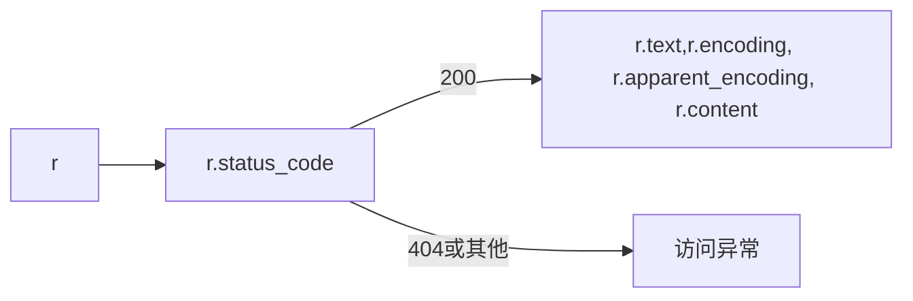

# Request库、Robots协议及API的使用

## 一. get()方法

r = requests.get(url,params=None,**kwargs)

构造一个向服务器请求资源的Request对象

返回一个包含服务器资源的Response对象

- url：拟获取页面的url链接

- params：url中的额外参数，字典或字节流格式，可选

- **kwargs：12个控制访问的参数，可选

### 1. Response对象

包含服务器返回的所有信息

#### （1）属性

| 属性                | 说明                                                    |
| ------------------- | ------------------------------------------------------- |
| r.status_code       | HTTP请求的返回状态，200表示成功，404表示失败            |
| r.text              | HTTP响应内容的字符串形式，即url对应的页面内容           |
| r.encoding          | 根据HTTP的header中的charset字段，猜测的响应内容编码方式 |
| r.apparent_encoding | 根据网页的内容，分析出的响应编码方式（备选编码方式）    |
| r.content           | HTTP响应内容的二进制形式                                |



#### （2）Response的编码

- r.encoding：如果header中有charset字段，说明访问的服务器对其资源的编码是有要求的，编码获得后存在encoding中；如果header中没有charset字段，则默认编码为IOS-8859-1（该编码不能解析中文）

- r.apparent_encoding：当利用r.encoding不能正确解码返回内容时，则利用该方法获得备选编码方式，r.encoding=r.apparent_encoding，再去获得内容r.text

## 2. 爬取网页的通用代码框架

#### （1）Requests库的异常

| 异常                      | 说明                                    |
| ------------------------- | --------------------------------------- |
| requests.ConnectionError  | 网络连接异常，如DNS查询失败、拒绝连接等 |
| requests.HTTPError        | HTTP错误异常                            |
| requests.URLRequired      | URL缺失异常                             |
| requests.TooManyRedirects | 超过最大重定向次数，产生重定向异常      |
| requests.ConnectTimeout   | 连接远程服务器超时异常                  |
| requests.Timeout          | 请求URL超时，产生超时异常               |

#### （2）Response的异常

| 异常                 | 说明                                    |
| -------------------- | --------------------------------------- |
| r.raise_for_status() | 如果不是200，产生异常requests.HTTPError |

#### （3）爬取网页的通用框架

```python
import requests

#爬去网页的通用代码框架
def getHTMLText(url):
    try:
        r = requests.get(url, timeout=30)
        r.raise_for_status() #如果状态不是200，引发HTTPError异常
        r.encoding = r.apparent_encoding
        return r.text
    except:
        return "产生异常"

if __name__ == "__main__":
    url = "http://www.baidu.com"
    print(getHTMLText(url))
```

## 二. Requests库的主要方法及解析

### 1. HTTP协议

Hypertext Transfer Protocol，超文本传输协议

- 基于“请求与响应”模式的、无状态的应用层协议

- 采用URL作为定位网络资源的标识

#### （1）URL

URL是通过HTTP协议存取资源的Internet路径，一个URL对应一个数据资源

格式：<http://host[:post]][path]>

- host：合法的Internet主机域名或IP地址

- port：端口号，这部分可以省略，缺省时默认端口号为80

- path：请求资源的路径

举个例子：<http://220.181.111.188/duty> 指220.181.111.188这样的IP主机上，duty目录下的相关资源

#### （2）HTTP协议对资源的操作

HTTP协议对资源的操作的六个方法，是与Requests库的六个主要方法一一对应。

| 方法   | 说明                                                         | Requests库方法    |
| ------ | ------------------------------------------------------------ | ----------------- |
| GET    | 请求获取URL位置的资源                                        | requests.get()    |
| HEAD   | 请求获取URL位置资源的响应消息报告，即获得该资源的头部信息    | requests.head()   |
| POST   | 请求向URL位置的资源后附加新的数据                            | requests.post()   |
| PUT    | 请求向URL位置存储一个资源，覆盖原URL位置的资源               | requests.put()    |
| PATCH  | 请求局部更新URL位置的资源，即改变该处资源的部分内容（节省网络带宽） | requests.patch()  |
| DELETE | 请求删除URL位置的资源                                        | requests.delete() |

HTTP协议通过URL对资源进行定位，利用六个方法对资源进行管理。HTTP协议对资源的每一次操作都是独立无状态的。HTTP协议中网络通道和服务器是黑盒子，只能看到url，以及对url的相关操作。

### 2. Requests库的一些主要方法的举例

- head()方法

  用很少的网络流量获得网络资源的概要信息

  ```python
  >>> r = requests.head("http://httpbin.org/get")
  >>> r.headers
  {'Date': 'Sun, 19 Apr 2020 09:27:01 GMT', 'Content-Type': 'application/json', 'Content-Length': '307', 'Connection': 'keep-alive', 'Server': 'gunicorn/19.9.0', 'Access-Control-Allow-Origin': '*', 'Access-Control-Allow-Credentials': 'true'}
  >>> r.text
  ''
  ```

- post()方法

  根据用户提交内容的不同会在服务器上进行相关整理

  向URL post一个字典或者键值对时，会自动编码为form(表单)，即存储在form域中

  ```python
  >>> payload = {'key1':'value1','key2':'value2'}
  >>> r = requests.post('http://httpbin.org/post', data = payload)
  >>> print(r.text)
  {
    "args": {}, 
    "data": "", 
    "files": {}, 
    "form": {
      "key1": "value1", 
      "key2": "value2"
    }, 
    "headers": {
      "Accept": "*/*", 
      "Accept-Encoding": "gzip, deflate", 
      "Content-Length": "23", 
      "Content-Type": "application/x-www-form-urlencoded", 
      "Host": "httpbin.org", 
      "User-Agent": "python-requests/2.23.0", 
      "X-Amzn-Trace-Id": "Root=1-5e9c1ac5-4fb233e8bbc88b601dca8e60"
    }, 
    "json": null, 
    "origin": "123.138.94.196", 
    "url": "http://httpbin.org/post"
  }
  ```

  向URL post一个字符串时，会自动编码为data(表单)，即存储在data域中

  ```python
  >>> r = requests.post('http://httpbin.org/post', data = 'ABC')
  >>> print(r.text)
  {
    "args": {}, 
    "data": "ABC", 
    "files": {}, 
    "form": {}, 
    "headers": {
      "Accept": "*/*", 
      "Accept-Encoding": "gzip, deflate", 
      "Content-Length": "3", 
      "Host": "httpbin.org", 
      "User-Agent": "python-requests/2.23.0", 
      "X-Amzn-Trace-Id": "Root=1-5e9c1d5f-76b04598ae8cee00fe5ce640"
    }, 
    "json": null, 
    "origin": "123.138.94.196", 
    "url": "http://httpbin.org/post"
  }
  ```

### 3. Requests库的主要方法及解析

| 方法               | 说明                                           |
| ------------------ | ---------------------------------------------- |
| requests.request() | 构造一个请求，支撑以下方法的基础方法           |
| requests.get()     | 获取HTML网页的主要方法，对应于HTTP的GET        |
| requests.head()    | 获取HTML网页头信息的方法，对应于HTTP的HEAD     |
| requests.post()    | 向HTML网页提交POST请求的方法，对应于HTTP的POST |
| requests.put()     | 向HTML网页提交PUT请求的方法，对应于HTTP的PUT   |
| requests.patch()   | 向HTML网页提交局部修改请求，对应于HTTP的PATCH  |
| requests.delete()  | 向HTML网页提交删除请求，对应于HTTP的DELETE     |

#### （1）requests()方法

requests.request(method, url, **kwargs)

- method：请求方式，就是HTTP协议的请求功能。有‘GET’, 'HEAD', 'POST', 'POST', 'PUT', 'PATCH', 'delete', 'OPTIONS'(与获取资源不直接相关，用的比较少)。不同请求方式的request()方法封装后就是对应的Requests库的其他六个主要方法

- url：拟获取页面的url链接

- **kwargs：13个控制访问的参数，可选(由于是可选的，在代码中要以命名形式调用)，具体如下

1. **params**：字典或字节序列，作为参数增加到url中

   ```python
   >>> kv = {'key1':'value1','key2':'value2'}
   >>> r = requests.request('GET','http://python123.io/ws',params=kv)
   >>> print(r.url)
   https://python123.io/ws?key1=value1&key2=value2
     #把键值对增加到url中，即 ？后面的内容。再访问url时，不仅访问资源，还访问了这些参数，服务器可以根据这些参数筛选部分资源进行返回
   ```

2. **data**：字典、字节序列或文件对象，作为Request的内容

   ```python
   >>> r = requests.request('POST','http://python123.io/ws',data=kv)
   ```

3. **json**：JSON格式的数据，作为Request的内容

   ```python
   >>> r = requests.request('POST','http://python123.io/ws',json=kv)
   ```

4. **headers**：字典，定制HTTP的协议头

   ```python
   >>> hd = {'user-agent':'Chrome/10'}
   >>> r = requests.request('POST','http://python123.io/ws',headers=hd)
   #模拟第十个版本的Chrome浏览器向服务器发起访问
   ```

5. cookies：字典或CookieJar，Request中的cookie

6. auth：元组，支持HTTP认证功能

7. files：字典类型，向服务器传输文件

   ```python
   >>> fs = {'file': open('data.xls','rb')}
   >>> r = requests.request('POST','http://python123.io/ws',files=fs)
   ```

8. timeout：设定超时时间，秒为单位。在‘GET’中，如果超过时间没有返回请求内容，则会返回Timeout异常

9. proxies：字典类型，设定访问代理服务器，可以增加登陆认证

10. allow_redirects：True/False，默认为True，重定向开关

11. stream：True/False，默认为True，获取内容立即下载开关

12. verify：True/False，默认为True，认证SSL证书开关

13. cert：本地SSL证书路径

#### （2）其他六个主要方法

requests.get(url, params=None,  **kwargs)

- url：拟获取页面的url链接

- params：url中的额外参数，字典或字节流格式，可选

- **kwargs：12个控制访问的参数，可选(request方法中13个控制访问参数除去params)

requests.head(url,  **kwargs)

requests.post(url,  data=None, json=None, **kwargs)

requests.put(url,  data=None, **kwargs)

requests.patch(url,  data=None, **kwargs)

requests.delete(url,  **kwargs)

## 三 . Robots协议

Robots Exclusion Standard 网络爬虫排除标准

- 作用：网站告知爬虫哪些页面可以抓取，哪些不行

- 形式：在网站<u>根目录</u>下的robots.txt文件，再网站后面加/robots.txt即可查看网站的Robots协议，并不是每个网站都有

- Robots协议基本语法：

  ```
  # *表示所有，/表示根目录
  User-agent: *   #指哪些爬虫
  Disallow: /     #不允许该爬虫访问的资源目录
  ```

举例：京东的robots协议<https://www.jd.com/robots.txt>


Robots协议是建议但非约束性，网络爬虫可以不遵守，但是存在法律风险。类人行为可不参考Robots协议，比如一天或一小时只访问几次，对服务器不造成巨大影响。

## 四. API的使用

- 网络数据的采集不一定通过网页抓取数据，也可以用过API。

- API（Application Programming Iterface）为开发着提供一种方便友好的接口，不同的开发者用不同的语言都能获得相同的数据。

- API会以XML或JSON格式来返回服务器的响应。

